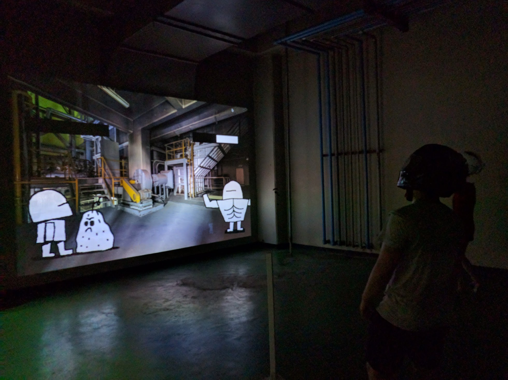
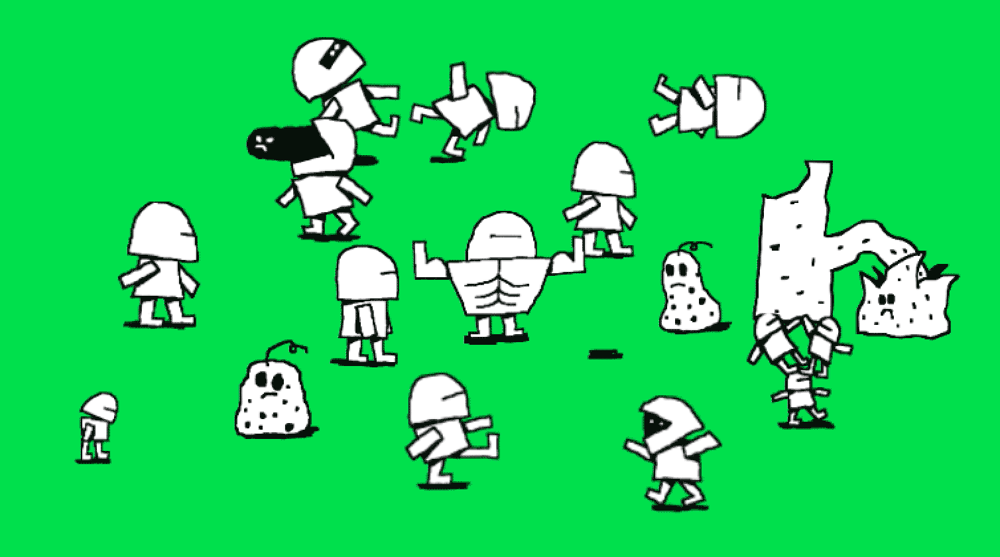

## Ghost Motor Karaoke
####고스트 모터 가라오케

###### Description

Motor Karaoke is a human voice powered game, for which microphones are placed inside two motorcycle helmets. By wearing them, two participants fight each other by screaming as loud and as long as they can to repell an appearing ghost and smash it in the face of their opponent.
The louder and the longer you scream, the better it is.

고스트 모터 가라오케는은 사람 목소리로 작동하는 게임입니다.
내부에 마이크가 설치된 오토바이 헬멧을 쓰고 두 사람이 소리를질러서 상대방의 얼굴 앞에 나타나는 유령을 물리치고박살내면서 대결합니다.
최대한 큰 소리로 오래 소리지른 사람이 이깁니다.

*This piece is a part of the Spectrum Syndicat Festival – Seoul, South Korea*

###### Credit

- Game concept and game design : Shobo
- Game development : Bastien Didier
- Sound design : Gangpol

###### Ghost Motor Karoke Gallery

